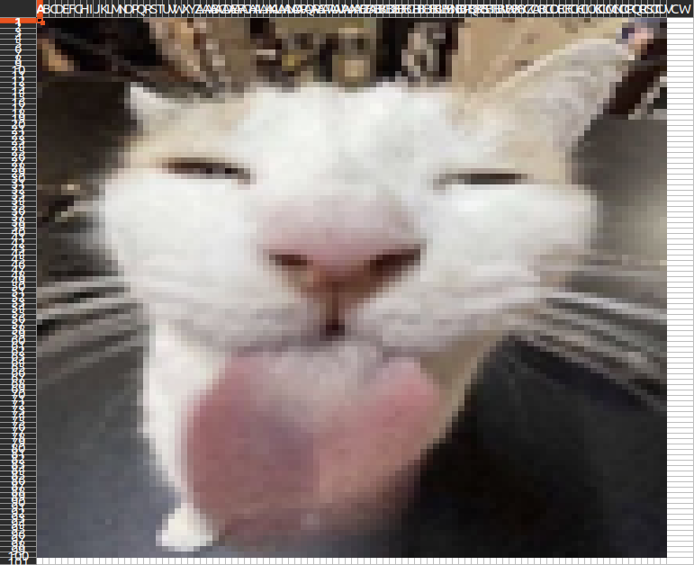

# 🖼️ Image to Spreadsheet

Simple tool to convert an image into a color-coded Excel spreadsheet, where each cell represents a pixel from the image.
Created to add funny images to a spreadsheet I was doing, good for pixel art!

## Project Structure

```
image_to_spreadsheet/
├── imageToSpreadsheet.py      # Main entry point
├── scripts/
│   └── converter.py           # Script with the conversion logic
├── cat.jpg                    # Example input image
├── README.md
```

## ✅ Requirements

-   Python 3.7+
-   Install dependencies with:

```bash
pip install pillow openpyxl
```

## 🛠️ Usage

Run the main script with:

```bash
python imageToSpreadsheet.py -f cat.jpg -o cat_output.xlsx
```

Or use the optional arguments for width and height with:

```bash
python imageToSpreadsheet.py -f cat.jpg -o cat_output.xlsx --width 80 --height 80
```

This will create `cat_output.xlsx` with each cell colored to match the resized image.
Here’s how a converted spreadsheet looks like:

<p align="center">
  
</p>

### Arguments

| Flag             | Description                                    | Required |
| ---------------- | ---------------------------------------------- | -------- |
| `-f`, `--file`   | Path to the input image file (jpg, png, etc.)  | Yes      |
| `-o`, `--output` | Output Excel file name (must end with `.xlsx`) | Yes      |
| `--width`        | Width to resize the image to (default: 100)    | No       |
| `--height`       | Height to resize the image to (default: 100)   | No       |

## Important!

-   Supported input formats: `.jpg`, `.jpeg`, `.png`, `.bmp`
-   Output format is always `.xlsx` (Excel 2007+)
-   Make sure your image isn't too large or the spreadsheet may become slow as one cell represents one pixel, if thats the case use to optional width and height arguments to resize the image!
